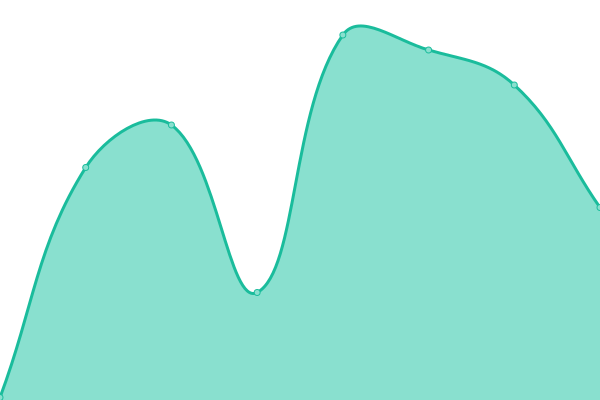
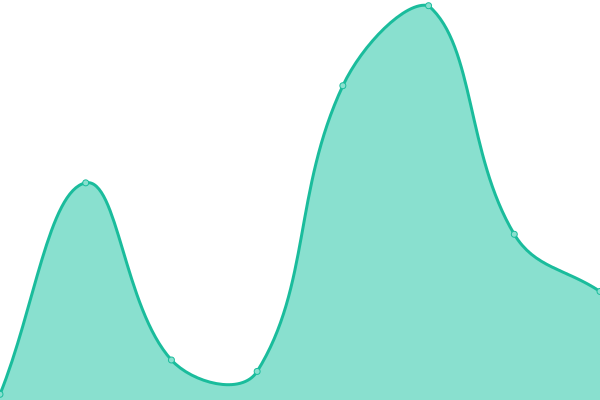
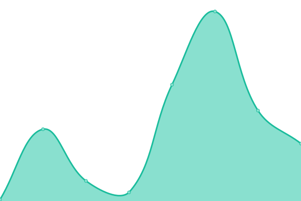

# [📈 Live Status](https://JohamSMC.github.io/upptime): <!--live status--> **🟧 Partial outage**

This repository contains the open-source uptime monitor and status page for [Joham Sebastian Medina Corredor](https://JohamSMC.github.io/upptime), powered by [Upptime](https://github.com/upptime/upptime).

With [Upptime](https://upptime.js.org), you can get your own unlimited and free uptime monitor and status page, powered entirely by a GitHub repository. We use [Issues](https://github.com/JohamSMC/upptime/issues) as incident reports, [Actions](https://github.com/JohamSMC/upptime/actions) as uptime monitors, and [Pages](https://JohamSMC.github.io/upptime) for the status page.

<!--start: status pages-->
<!-- This summary is generated by Upptime (https://github.com/upptime/upptime) -->
<!-- Do not edit this manually, your changes will be overwritten -->
<!-- prettier-ignore -->
| URL | Status | History | Response Time | Uptime |
| --- | ------ | ------- | ------------- | ------ |
|  [Google](https://www.google.com) | 🟩 Up | [google.yml](https://github.com/JohamSMC/upptime/commits/HEAD/history/google.yml) | 

 161ms
     
 | 

<a href="https://JohamSMC.github.io/upptime/history/google">99.67%</a>
    

|  [HowCreateServer](https://johamsmc.github.io/HowCreateServer/) | 🟩 Up | [how-create-server.yml](https://github.com/JohamSMC/upptime/commits/HEAD/history/how-create-server.yml) | 

 67ms
     
 | 

<a href="https://JohamSMC.github.io/upptime/history/how-create-server">100.00%</a>
    

|  [parallaxScrolling](https://johamsmc.github.io/html-parallaxScrolling/) | 🟩 Up | [parallax-scrolling.yml](https://github.com/JohamSMC/upptime/commits/HEAD/history/parallax-scrolling.yml) | 

 42ms
     
 | 

<a href="https://JohamSMC.github.io/upptime/history/parallax-scrolling">100.00%</a>
    

|  [HTML - Colombia](https://johamsmc.github.io/html-colombia/index.html) | 🟩 Up | [html-colombia.yml](https://github.com/JohamSMC/upptime/commits/HEAD/history/html-colombia.yml) | 

 47ms
     
 | 

<a href="https://JohamSMC.github.io/upptime/history/html-colombia">100.00%</a>
    

|  [HTML - responsiveImagePop-Up](https://johamsmc.github.io/responsiveImagePop-Up) | 🟩 Up | [html-responsive-image-pop-up.yml](https://github.com/JohamSMC/upptime/commits/HEAD/history/html-responsive-image-pop-up.yml) | 

 74ms
     
 | 

<a href="https://JohamSMC.github.io/upptime/history/html-responsive-image-pop-up">100.00%</a>
    

|  [Test Broken Site](https://thissitedoesnotexist.koj.co) | 🟥 Down | [test-broken-site.yml](https://github.com/JohamSMC/upptime/commits/HEAD/history/test-broken-site.yml) | 

 0ms
     
 | 

<a href="https://JohamSMC.github.io/upptime/history/test-broken-site">100.00%</a>
    

<!--end: status pages-->

[**Visit our status website →**](https://JohamSMC.github.io/upptime)

## 📄 License

- Powered by: [Upptime](https://github.com/upptime/upptime)
- Code: [MIT](./LICENSE) © [Joham Sebastian Medina Corredor](https://JohamSMC.github.io/upptime)
- Data in the `./history` directory: [Open Database License](https://opendatacommons.org/licenses/odbl/1-0/)
